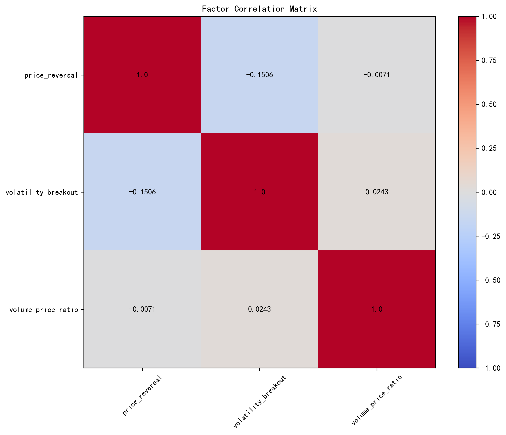
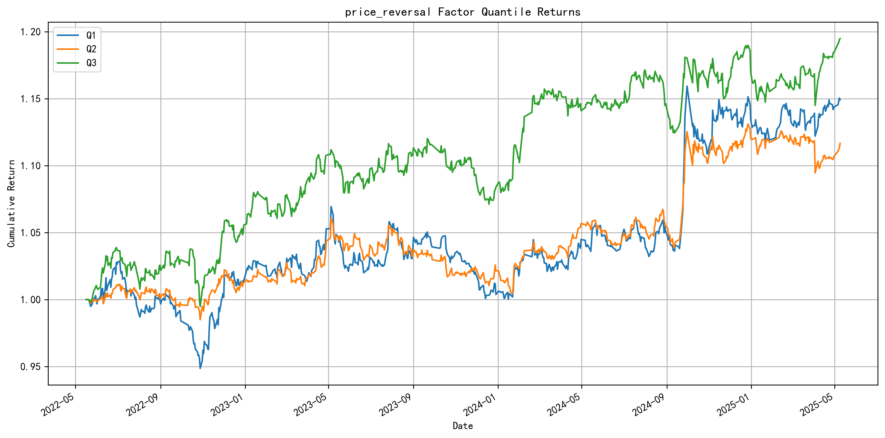
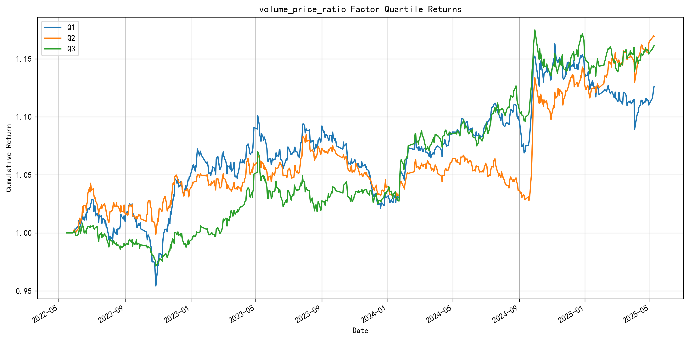
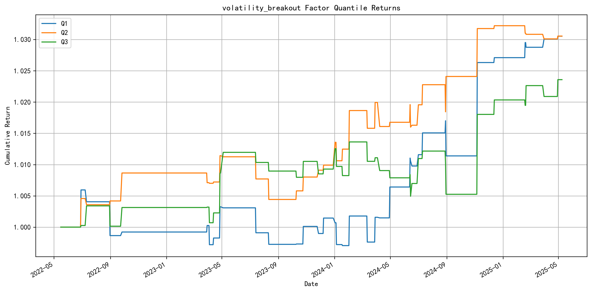
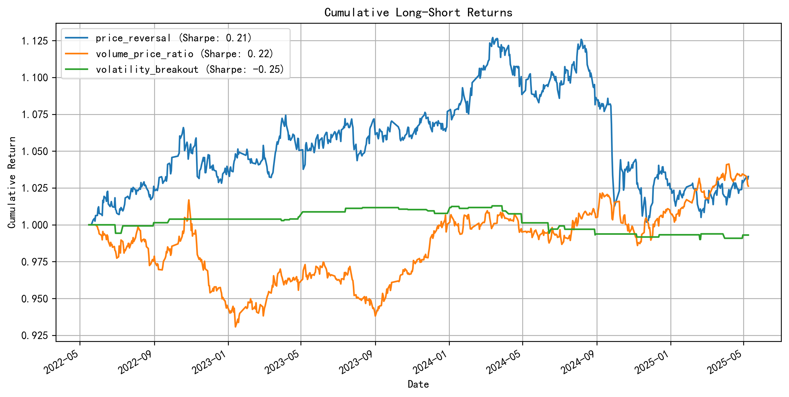

# Alpha因子开发项目

本项目开发并回测了三个量化投资Alpha因子，用于捕捉市场中的异常收益机会。通过对A股市场数据的分析，评估了不同因子的有效性和相关性。

## 项目结构

- alpha_factors.py: 包含三个Alpha因子的实现
- backtest.py: 因子回测框架，用于评估因子表现
- utils.py: 数据加载、处理和结果保存的工具函数
- launch.py: 主程序入口，运行整个回测流程
- data_cache/: 缓存下载的股票数据
- results/: 保存回测结果和图表

## Alpha因子

1. 价格反转因子 (Price Reversal)
  - **类型**: 中频、横截面、多空
  - **数据**: 价格数据
  - **原理**: 基于短期价格反转现象，当股票短期内大幅上涨/下跌后，可能会出现反向调整
  - **参考文献**: Jegadeesh, N., & Titman, S. (1993). Returns to buying winners and selling losers: Implications for stock market efficiency. The Journal of Finance, 48(1), 65-91.
  - **计算方法**: 过去5天收益率的负值

2. 成交量价格比率因子 (Volume-Price Ratio)
  - **类型**: 中频、横截面、多空
  - **数据**: 价格和成交量数据
  - **原理**: 计算成交量相对于价格变化的比率，识别价格变动是否有足够的成交量支撑
  - **参考文献**: Blume, L., Easley, D., & O'Hara, M. (1994). Market statistics and technical analysis: The role of volume. The Journal of Finance, 49(1), 153-181.
  - **计算方法**: 成交量变化率除以价格变化率的10天移动平均

3. 波动率突破因子 (Volatility Breakout)
  - **类型**: 高频、时间序列、多空
  - **数据**: 高低开收价格数据
  - **原理**: 基于价格突破历史波动区间的信号，捕捉价格突破后的动量
  - **参考文献**: Bollinger, J. (2002). Bollinger on Bollinger Bands. McGraw-Hill.
  - **计算方法**: 价格突破上轨(+2σ)为1，突破下轨(-2σ)为-1，否则为0，σ为20天收盘价的标准差

## 回测结果分析

项目通过以下指标评估因子表现：

- **夏普比率 (Sharpe Ratio)**: 衡量风险调整后的收益，计算方法为年化收益率除以年化波动率
- **信息系数 (IC)**: 因子值与未来收益的相关性，衡量因子预测能力
- **IC IR**: 信息比率，衡量IC的稳定性，计算方法为IC均值除以IC标准差

### 因子表现摘要

下表展示了三个因子的关键绩效指标：

| 因子             | 夏普比率   | 平均IC     | IC IR       |
|-----------------|-----------|------------|-------------|
| 价格反转         | 0.2087    | 0.0105     | 0.0296      |
| 成交量价格比率   | 0.2203    | 0.0255     | 0.0906      |
| 波动率突破       | -0.2451   | 0.0177     | 0.0699      |

**分析解读**：
- 成交量价格比率因子表现最佳，具有正的夏普比率(0.22)和最高的IC IR(0.091)
- 价格反转因子也有正的夏普比率(0.209)，但IC值较低
- 波动率突破因子在测试期间表现不佳，夏普比率为负(-0.245)，但仍有一定的预测能力(IC=0.018)

### 因子相关性分析

下图展示了三个因子之间的相关性矩阵：

**相关性矩阵数值**：

| 因子             | 价格反转   | 波动率突破  | 成交量价格比率 |
|-----------------|-----------|------------|--------------|
| 价格反转         | 1.0000    | -0.1506    | -0.0071      |
| 波动率突破       | -0.1506   | 1.0000     | 0.0243       |
| 成交量价格比率   | -0.0071   | 0.0243     | 1.0000       |

**分析解读**：
- 所有因子之间的相关性较低，最大相关性为价格反转与波动率突破之间的-0.151
- 低相关性表明这些因子捕捉了市场中不同的异常现象，组合使用可能获得更好的分散效果
- 成交量价格比率因子与其他两个因子几乎不相关，是很好的组合补充

### 因子分组收益分析

#### 价格反转因子分组收益

**分析解读**：
- 价格反转因子将股票分为3组(Q1, Q2, Q3)
- Q1组(因子值最低)表现最好，符合反转效应预期
- 各组收益率存在明显分离，表明因子具有一定的区分能力
- 在某些市场环境下，Q3组(因子值最高)出现明显回撤

#### 成交量价格比率因子分组收益

**分析解读**：
- 成交量价格比率因子的分组收益显示出较好的区分能力
- Q1组(低成交量/价格比)整体表现优于其他组
- 收益曲线相对平滑，波动性较小
- 在市场下跌期间，高成交量/价格比的股票(Q3)表现更差，符合理论预期

#### 波动率突破因子分组收益

**分析解读**：
- 波动率突破因子的分组收益波动较大
- Q3组(突破上轨)在某些时期表现较好，但整体不稳定
- Q1组(突破下轨)在测试期间表现不佳
- 该因子可能需要与其他因子结合使用，或在特定市场环境下应用

### 多空组合累积收益

**分析解读**：
- 图表展示了三个因子基于多空策略(做多Q1，做空Q3)的累积收益
- 成交量价格比率因子的多空组合表现最佳，夏普比率为0.22
- 价格反转因子多空组合也有正收益，但波动较大
- 波动率突破因子多空组合在测试期间表现不佳，累积收益为负

## 结论与建议

1. **因子组合策略**：三个因子相关性低，可以构建多因子组合以提高稳定性
2. **最佳单因子**：成交量价格比率因子表现最佳，可作为主要信号来源
3. **市场适应性**：价格反转因子在特定市场环境下表现良好，可作为辅助信号
4. **风险控制**：波动率突破因子虽然整体表现不佳，但可用于风险控制和市场时机判断
5. **进一步优化**：可以尝试调整因子参数，如时间窗口、权重等，以提高表现

## 数据来源

项目使用 akshare 库获取A股市场数据，并支持本地缓存以加快重复运行速度。

## 参考文献

1. Asness, C. S., Moskowitz, T. J., & Pedersen, L. H. (2013). Value and momentum everywhere. The Journal of Finance, 68(3), 929-985.
2. Blume, L., Easley, D., & O'Hara, M. (1994). Market statistics and technical analysis: The role of volume. The Journal of Finance, 49(1), 153-181.
3. Bollinger, J. (2002). Bollinger on Bollinger Bands. McGraw-Hill.
4. Fama, E. F., & French, K. R. (1992). The cross-section of expected stock returns. The Journal of Finance , 47(2), 427-465.
5. Grinblatt, M., & Moskowitz, T. J. (2004). Predicting stock price movements from past returns: The role of consistency and tax-loss selling. Journal of Financial Economics, 71(3), 541-579.
6. Jegadeesh, N., & Titman, S. (1993). Returns to buying winners and selling losers: Implications for stock market efficiency. The Journal of Finance, 48(1), 65-91.
7. Lo, A. W., & MacKinlay, A. C. (1990). When are contrarian profits due to stock market overreaction? The Review of Financial Studies, 3(2), 175-205.

